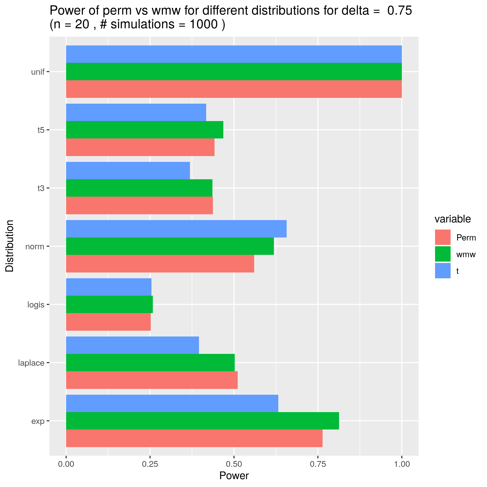
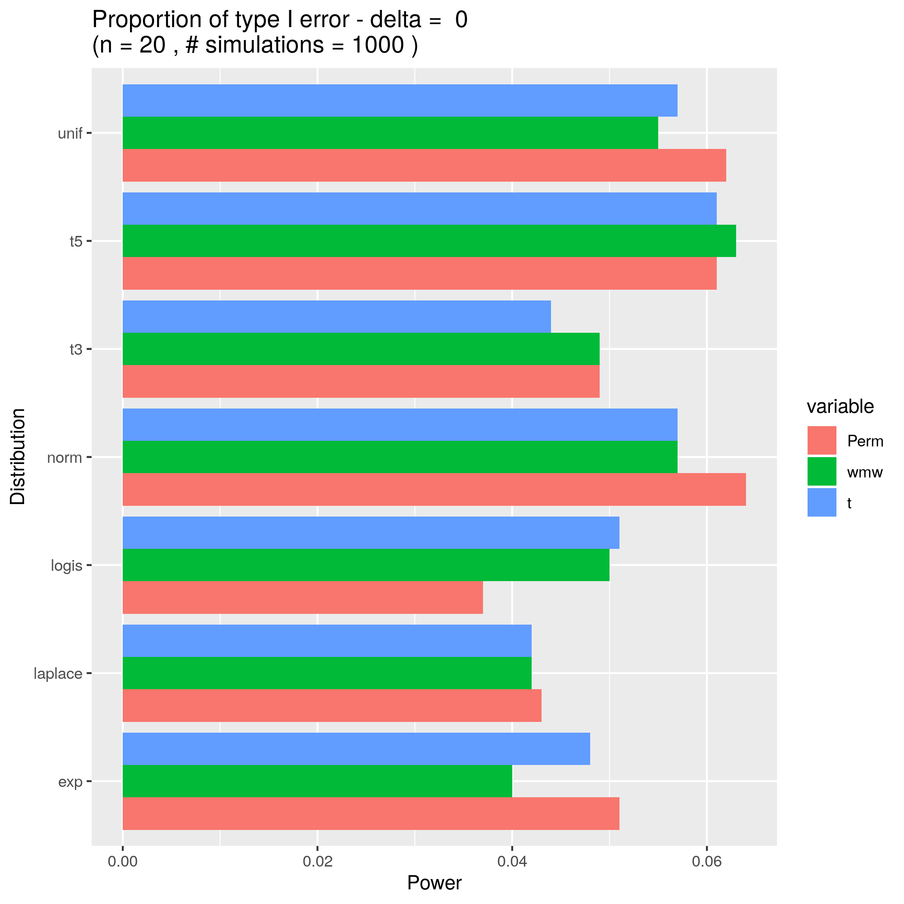

```{r setup, include=FALSE}
knitr::opts_chunk$set(echo = TRUE)
```

# R function: $\texttt{median.test(x,y)}$

The function $\texttt{median.test(x,y)}$ calculates a permutation p-value associated with $H_{0} : F_{x} = F_{y}$ versus $H_{A} : median_{x} \neq median_{y}$. If the total amount of combinations exceeds 10000, the null-distribution is generated from 10000 random samples. The code is listed below, the included R comments can guide the reader through the code.

\vspace{12pt}

```{r testmedian}
# FUNCTION: calc.median.diff: --------------
# Function: calculate the difference in median between two groups.
#
# param: ind = the indices of the first group
# param: vec = the complete list with data from group 1 and group 2
#
calc.median.diff <- function(ind, vec){
  # make both groups
  group1 <- vec[ind]
  group2 <- vec[!(1:length(vec)) %in% ind]
  # calculate the difference in medians
  return(median(group1) - median(group2))
}

# FUNCTION: median.test: --------------
# Function: calculate the p-value of the median difference between
# vector x and vector y, based on the null hypothesis F1(x) = F2(x)
#
# When the number of combinations is sufficiently small to do a full 
# permutation test (limit at 15000), the full permutation test will
# be performed. 
#
# param: x = vector values for group 1
# param: y = vector values group 2
#
median.test <- function(x, y){
  N <- 10000
  realization <- median(x) - median(y)
  len_x <- length(x)
  len_y <- length(y)
  vec <- c(x, y)
  len_vec <- len_x + len_y
  if(choose(n = len_x+len_y, len_x) < N){
    #cat('A limited number of combinations: full permutation test')
    median.diff <- combn(len_vec, 
                         len_x, 
                         function(ind){
                           return(calc.median.diff(ind, vec))
                         })
  } else {
    #cat('Too many combinations - A sample test will be performed.\n')
    median.diff <- replicate(N, 
                             calc.median.diff(
                               sample(c(1:len_vec),len_x), 
                               vec)
    )
  }
  if(FALSE){
    hist(abs(median.diff), main = paste('p = ', 
                                        mean(abs(realization) <= abs(median.diff))))
    abline(v = abs(realization), col = "red",
           lty = 1, lwd = 2)
  }
  # The distribution will be symmetrical. The p-value can be calculated by taking
  # the absolute value.
  return(mean(abs(realization) <= abs(median.diff)))
}
```

# Comparison to other tests
## Power

To evaluate the power of the median test as compared to other statistical tests, the proportions of true positive outcomes of the median test, the permutation t-test and the Wilcoxon–Mann–Whitney test were acquired through Monte Carlo simulation. Samples (n = 20 and n = 40) were randomly drawn from different distributions under $H_{a}$ (i.e. for a given delta $\neq$ 0).
<p>
{ width=400px }
</p>

## Type-I error rate

Next, the simulations were repeated under $H_{0}$ (i.e. with delta set equal to zero) to compare the type-I error rate of the median test with the permutation t-test and the Wilcoxon–Mann–Whitney test.
<p>
{ width=400px }
</p>

# Conclusion

Lorem ipsum dolor sit amet, consectetur adipiscing elit. Nunc rhoncus orci vitae nisl mollis dictum. Donec non nulla augue. Nullam turpis ligula, vehicula at consectetur in, finibus eget urna. Proin eget massa pellentesque, efficitur orci gravida, ullamcorper massa. Aliquam erat volutpat. Morbi lobortis enim eu mauris commodo posuere. Duis mauris sem, convallis non auctor sit amet, aliquet interdum lorem. Morbi id ultricies diam. Sed eu lacus ut massa elementum tempus. Nulla facilisi. Ut ac nulla vel diam ultrices gravida at sed neque. Aliquam bibendum orci eu felis ultricies, a vestibulum mauris pulvinar.


\pagebreak
# Addendum: full code

```{r addendum, eval=FALSE}
# HOMEWORK 3
# Group nr 15
#
#
# Install and load packages
packages <- c('coin','ggplot2', 'reshape2', 'rmutil')
# install.packages(packages)
lapply(packages, library, character.only = TRUE)
#
# FUNCTION: calc.median.diff: --------------
# Function: calculate the difference in median between two groups.
#
# param: ind = the indices of the first group
# param: vec = the complete list with data from group 1 and group 2
#
calc.median.diff <- function(ind, vec){
  # make both groups
  group1 <- vec[ind]
  group2 <- vec[!(1:length(vec)) %in% ind]
  # calculate the difference in medians
  return(median(group1) - median(group2))
}

# FUNCTION: median.test: --------------
# Function: calculate the p-value of the median difference between
# vector x and vector y, based on the null hypothesis F1(x) = F2(x)
#
# When the number of combinations is sufficiently small to do a full 
# permutation test (limit at 15000), the full permutation test will
# be performed. 
#
# param: x = vector values for group 1
# param: y = vector values group 2
#
median.test <- function(x, y){
  N <- 10000
  realization <- median(x) - median(y)
  len_x <- length(x)
  len_y <- length(y)
  vec <- c(x, y)
  len_vec <- len_x + len_y
  if(choose(n = len_x+len_y, len_x) < N){
    #cat('A limited number of combinations: full permutation test')
    median.diff <- combn(len_vec, 
                         len_x, 
                         function(ind){
                           return(calc.median.diff(ind, vec))
                         })
  } else {
    #cat('Too many combinations - A sample test will be performed.\n')
    median.diff <- replicate(N, 
                             calc.median.diff(
                               sample(c(1:len_vec),len_x), 
                               vec)
    )
  }
  if(FALSE){
    hist(abs(median.diff), main = paste('p = ', 
                                        mean(abs(realization) <= abs(median.diff))))
    abline(v = abs(realization), col = "red",
           lty = 1, lwd = 2)
  }
  # The distribution will be symmetrical. The p-value can be calculated by taking
  # the absolute value.
  return(mean(abs(realization) <= abs(median.diff)))
}

# Simulations
n <- 20         # sample size
N <- 200        # test simulations
distributions <- c('rt', 'rt', 'rexp', 'rlogis', 'rnorm', 'runif', 'rlaplace')
dist_names <- c('t3', 't5', 'exp', 'logis', 'norm', 'unif', 'laplace')
dist_args <- list(list(n, 3), list(n, 5), list(n), list(n), list(n), list(n), list(n))

power.med <- power.wmw <- power.t <- c()

# For simulations under H0 (delta = 0) and Ha (delta = 1)
for(delta in 0:1) {
  if(delta) {
    title <- paste0('Power_', n, '_', N) }
  else{
    title <- paste0('TypeI_error_', n, '_', N) }
  
  # for different distributions
  for(i in 1:length(distributions)) {
    cat(paste('power calculation for distribution : ',
              distributions[i], '\n'))
    p.med <- p.wmw <- p.t <- c()
    
    # perform N tests on randomly drawn samples Y1 and Y2
    for(j in 1:N) {
      Y1 <- do.call(what = distributions[i], 
                    args = dist_args[[i]])
      Y2 <- do.call(what = distributions[i], 
                    args = dist_args[[i]]) + delta * sd(Y1)/2
      df <- data.frame(rep(c('A', 'B'), each = n), c(Y1, Y2))
      colnames(df) <- c("group", "Y")
      p.med[j] <- median.test(x = Y1, y = Y2)
      p.wmw[j] <- wilcox.test(Y1, Y2, exact = TRUE)$p.value
      p.t[j] <- pvalue(oneway_test(Y~group, data = df, 
                                   distribution = approximate(nresample = 10000)))
    }
    # calculate the proportion of H0 rejections
    power.med[i] <- mean(p.med < 0.05)
    power.wmw[i] <- mean(p.wmw < 0.05)
    power.t[i] <- mean(p.t < 0.05)
  }
  df_power <- data.frame(Distribution = dist_names,
                         med = rep(x = 0.0, length(distributions)),
                         wmw = rep(x = 0.0, length(distributions)),
                         t = rep(x = 0.0, length(distributions)))
  
  df_power$med <- power.med
  df_power$wmw <- power.wmw
  df_power$t <- power.t
  df_power <- melt(df_power, id.vars = 'Distribution')
  
  write.csv(df_power, paste(title, '.csv', sep=''))
  
  p <- ggplot(data = df_power, aes(x = Distribution, y = value, fill = variable)) + 
    geom_bar(position = 'dodge', stat = 'identity') + 
    ggtitle(title) +
    xlab('Distribution') + 
    ylab('Power') +
    coord_flip()
  
  ggsave( paste(title, '.png', sep = ''), 
          plot = p, 
          device = 'png'
          )
}
```

